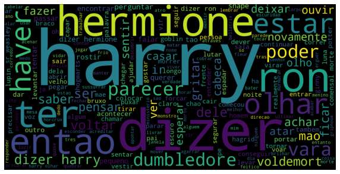
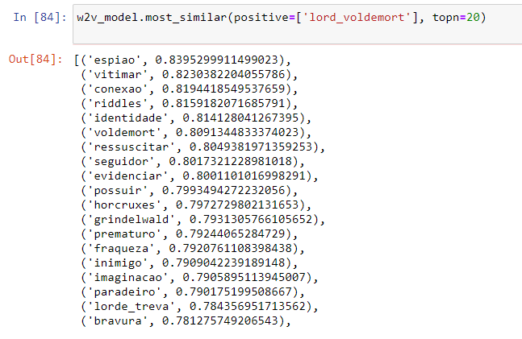
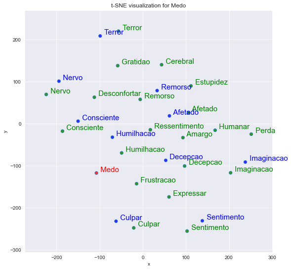

# Word2vec treinado com livros Harry Potter em Português

Neste repositório, vamos treinar um modelo **Word2Vec CBOW** com livros da série Harry Potter, da autora britânica J. K. Rowling.

Passos:

1. [Pré-processar o texto e gerar o modelo Word2Vec](https://github.com/lisaterumi/word2vec-harry-potter-portugues/blob/main/%5B1%5D%20Word2Vec%20Harry%20Potter.ipynb)
1. [Calcular similaridade e gerar gráficos tSNE](https://github.com/lisaterumi/word2vec-harry-potter-portugues/blob/main/%5B2%5D%20tSNE-Harry-Potter.ipynb)
1. [Gerar nuvens de palavras livro a livro](https://github.com/lisaterumi/word2vec-harry-potter-portugues/blob/main/%5B3%5D%20Nuvem-palavra-Harry-Potter.ipynb)
1. [Fazer uma análise de sentimentos livro a livro](https://github.com/lisaterumi/word2vec-harry-potter-portugues/blob/main/%5B4%5D%20Analise-Sentimentos-Harry-Potter.ipynb)

